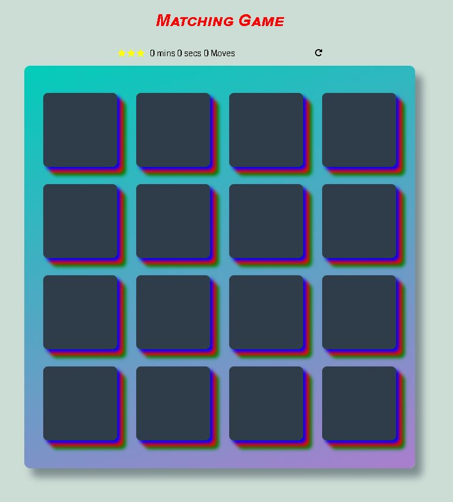

# Memory Game Project

 

## What is the Memory Game ??

The memory game, or concentration, is a popular card game played by children and adults around the world. You have to match cards in less time with less moves.

## Instructions

* Click on a card
* Keep revealing cards until finish
* Match cards properly with less moves and in faster time

## Acknowledgments

 * I followed the steps in the next tutorial: https://scotch.io/tutorials/how-to-build-a-memory-matching-game-in-javascript
 
